# 📅 On-Call Scheduler — Application Overview

**On-Call Scheduler** is a full-stack scheduling platform designed to help engineering or operational teams manage **on-call rotations, weekly schedules, team assignments, and PTO workflows** with ease and accuracy.
The system automates schedule generation, supports real-time editing, and provides a clean, enterprise-ready UI for managing people, teams, and calendar views.

---

## 🚀 What the Application Does

### ✅ **1. Team & People Management**

The system maintains foundational data needed for scheduling:

* Add, edit, and view **people** (on-call participants)
* Create and manage **teams**
* Assign **team members** to each on-call rotation group

---

### ✅ **2. Automatic Schedule Generation**

The backend generates full-year on-call schedules using:

* Team membership
* Rotation length (e.g., 7-day blocks)
* Selected year
* Week start preference (Monday or Sunday)

The system:

* Assigns primary and secondary on-call roles automatically
* Ensures fair, balanced rotation across all team members
* Creates database-persisted **Schedules** and **ScheduleSlots**

---

### ✅ **3. Modify/Override Schedule After Generation**

Users can:

* Swap any two weeks
* Edit primary/secondary assignments per slot
* Add notes (e.g., PTO coverage, exceptions)
* Save all modifications back to the backend

This gives teams complete flexibility while keeping the autogenerated rotation as a baseline.

---

### ✅ **4. Calendar View (Read + Modify)**

A dedicated calendar view lets users:

* Load schedule for a specific **team** and **year**
* See a detailed table of:

  * Slot number
  * Primary on-call
  * Secondary on-call
  * Start/end dates
  * Notes
* Edit schedule entries right from the calendar page
* Save changes into the database

Great for supervisors or admins who need high-level visibility.

---

### ✅ **5. Export Options**

Users can export schedules in multiple formats:

* **CSV** — ideal for spreadsheets or uploads
* **Markdown** — for documentation systems like Confluence or GitHub
* **ICS (iCalendar)** — importable into Outlook, Google Calendar, macOS Calendar, etc.

This makes sharing schedules extremely simple.

---

### ✅ **6. PTO / Vacation Admin Module**

Planned PTO can affect on-call rotations.
The app includes:

* PTO entry management
* Visibility into who is unavailable during specific weeks
* Ability to override assignments when someone is out

---

### 🔧 **7. Backend Architecture (FastAPI + SQLAlchemy)**

The API provides REST endpoints for:

* Teams
* People
* Schedule generation
* Schedule editing (override)
* Export functions

Data is stored in a relational database using SQLAlchemy ORM.

---

### 🎨 **8. Modern Frontend (Next.js + React)**

The frontend includes:

* Interactive, responsive dashboard
* Calendar visualization
* Enterprise-style UI components
* Real-time scheduling interactions
* Editable tables for schedule overrides

---

## 🧩 Why This Application Exists

Organizations with rotating on-call responsibilities often struggle with:

* Manual spreadsheets
* Human error during rotations
* Difficulty visualizing annual call schedules
* No easy way to export or integrate with calendars
* No consistent tool to modify and track changes

This project solves those problems by providing a **centralized, intelligent, automated** on-call management system.

---


### Features

* **People & Team Management**
* **Automated Schedule Generation** (year, rotation, week start)
* **Editable On-Call Schedule** (swap weeks, override assignments, add notes)
* **Team Calendar View with Editing**
* **Export to CSV, Markdown, ICS (iCalendar)**
* **PTO Admin Tools**
* **Modern UI (Next.js + React)**
* **FastAPI Backend with SQLAlchemy ORM**

The system ensures fair rotation distribution, accurate tracking, and seamless sharing of on-call schedules across teams.


---

## 📸 Screenshots


### Dashboard – Who’s On Call Now


### Generate Schedule – Auto Rotation


### Team Schedule Calendar – Load & Edit


### People Management – On-Call Participants


### PTO Admin – Time Off & Coverage


---

## Architecture flowchart

```mermaid
flowchart LR

  %% CLIENT LAYER
  U["User Browser<br/>(Engineer / On-call Admin)"]

  %% ========== INFRA (COMPOSE) ==========
  subgraph Infra["Docker Compose / Infra"]
    direction LR

    subgraph FE["Frontend (Next.js / React)"]
      FE_Pages["App Pages<br/>Dashboard · Generate · Calendar · People · Teams · PTO"]
      FE_API["API Client<br/>(apiGet / apiPost)"]
    end

    subgraph BE["Backend (FastAPI)"]
      BE_Routers["API Routers<br/>people.py · teams.py · schedules.py · pto.py"]
      BE_Scheduler["Scheduler &amp; Business Logic<br/>scheduler.py"]
      BE_Repos["Repositories (DB Access)<br/>repositories_db.py"]
      BE_Models["SQLAlchemy Models<br/>models_db.py · schemas.py"]
      BE_Notifications["Email Notifications<br/>notifications.py"]
    end

    subgraph DB["PostgreSQL Database"]
      T_people[("people")]
      T_teams[("teams")]
      T_members[("team_memberships")]
      T_schedules[("schedule_definitions")]
      T_slots[("oncall_slots")]
      T_pto[("pto")]
    end
  end

  Email["SMTP / Email Service"]

  %% ========== FLOWS ==========
  U -->|"HTTP/HTTPS<br/>http://localhost:3000"| FE_Pages
  FE_Pages --> FE_API
  FE_API -->|"REST JSON<br/>http://backend:8000"| BE_Routers

  BE_Routers --> BE_Scheduler
  BE_Routers --> BE_Repos
  BE_Repos --> BE_Models
  BE_Repos -->|"SQL"| DB

  BE_Scheduler -->|"read/write schedule &amp; slots"| DB
  BE_Scheduler --> BE_Notifications
  BE_Notifications -->|"on-call emails &amp; reminders"| Email

  %% DB TABLE RELATION HINTS
  T_people --> T_members
  T_teams --> T_members
  T_teams --> T_schedules
  T_schedules --> T_slots
  T_people --> T_slots
  T_people --> T_pto
  T_pto --> T_slots

```



This project contains:

- **backend/** – FastAPI + SQLAlchemy + Postgres
- **frontend/** – Next.js (App Router) React UI
- **docker-compose.yml** – to run Postgres, backend, and frontend together

## Quick start with Docker

From the project root:

```bash
docker-compose up --build

docker-compose down
docker-compose up --build

```

Then:

- Backend API: http://localhost:8000/docs
- Frontend UI: http://localhost:3000

## Running locally without Docker

### Backend

1. Install Python 3.11
2. Create virtualenv and install dependencies:

```bash
cd backend
python -m venv .venv
source .venv/bin/activate  # on Windows: .venv\\Scripts\\activate
pip install -r requirements.txt
```

3. Make sure you have a PostgreSQL instance running locally with:

- user: `oncall`
- password: `oncall`
- database: `oncall`

Or override via environment variables:

- `POSTGRES_USER`
- `POSTGRES_PASSWORD`
- `POSTGRES_DB`
- `POSTGRES_HOST`
- `POSTGRES_PORT`

4. Start the API:

```bash
uvicorn app.main:app --reload --port 8000
```

### Frontend

1. Install Node.js (v18+ recommended)
2. Install dependencies:

```bash
cd frontend
npm install
```

3. Make sure the backend is running on http://localhost:8000
4. Start Next.js dev server:

```bash
npm run dev
```

5. Open http://localhost:3000

## Basic usage flow

1. **Create people** via `POST /people` or use the API docs at `/docs`.
2. **Create teams** and add members.
3. Go to `http://localhost:3000/schedules/generate` to generate a schedule.
4. Use the **dashboard** at `/` to see who is on call now / this week / next week.
5. Use the **calendar** at `/schedules/calendar` to view on-call shifts and filter by person.
